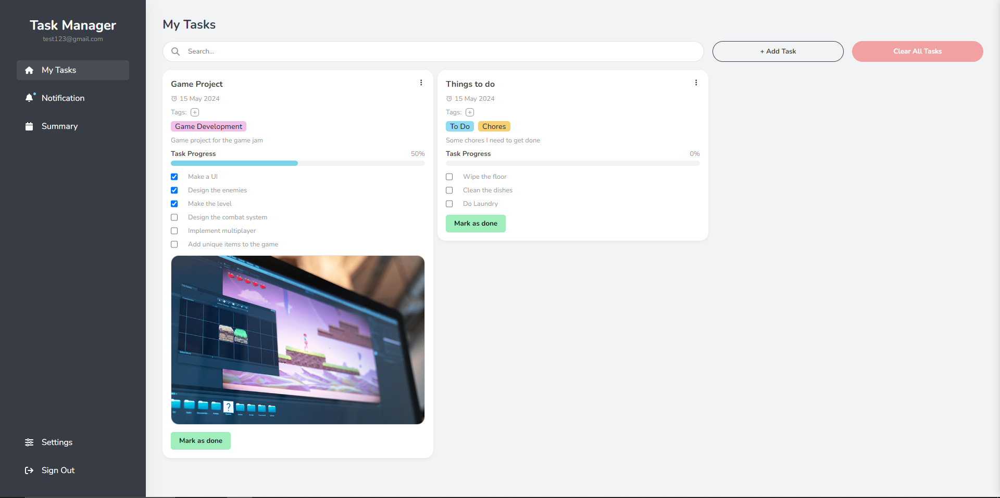
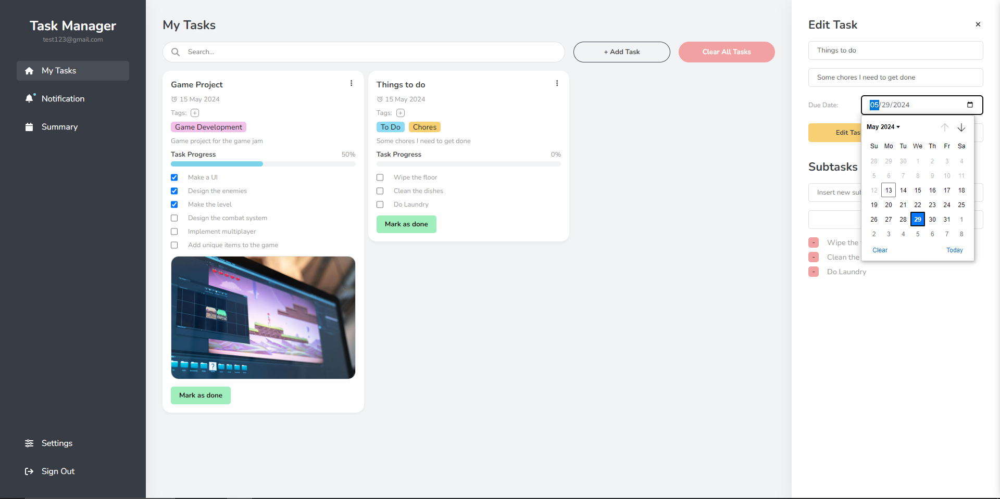
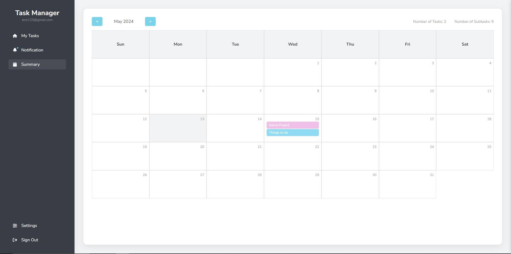
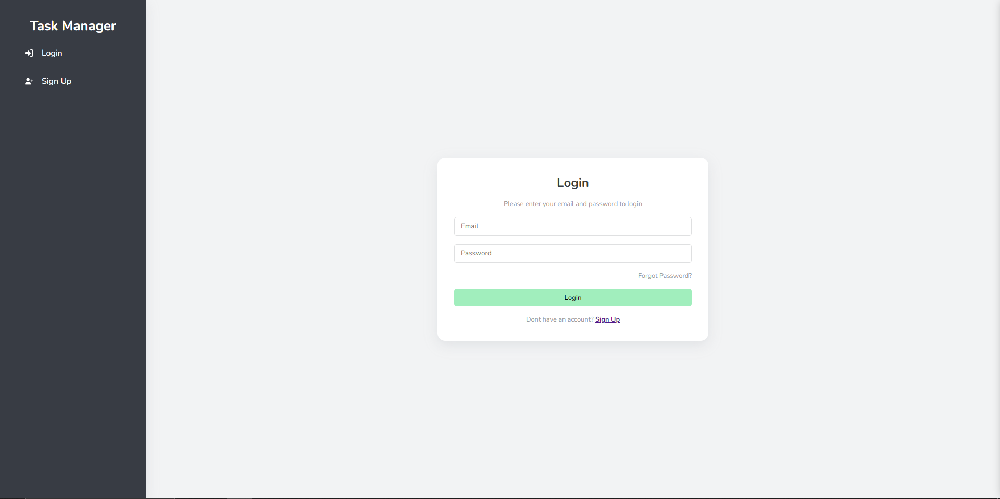

# Task Manager Website

A MERN stack website built using CRUD operation for managing daily or other tasks.

<h3>Features:</h3>

- Create a personal profile with authentication
- View task in a calendar style

  - User can click on a task to locate it in the main task view

- See notifications for tasks due immediately, upcoming and overdue tasks
- Add and delete custom tags from a task
- Customize tasks with more details using subtasks and track their progress
- Dark & Light Mode

<h3>Built with:</h3>
Built with React JS and SCSS for the front-end with Node JS and Mongo DB as the back-end

<h3>Dependencies:</h3>

- fontawesome
- bcrypt
- mongoose
- validator
- jwt

<h3>Images: </h3>

<h2>Main task page</h2>

<h2>Editing a task</h2>

<h2>Task summary page (calendar)</h2>

<h2>Login page</h2>

